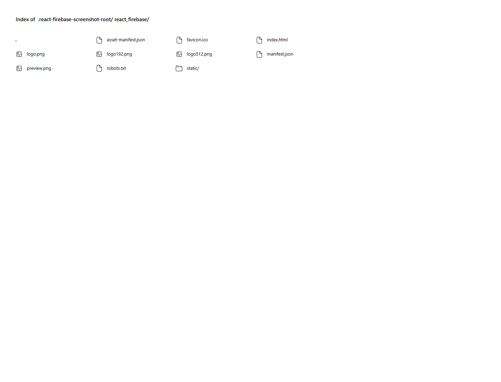

# Firebase User Manager

A responsive React and Firebase Firestore CRUD dashboard for creating users, increasing their age, and deleting records.



## Features

- Create users with name and age validation.
- Read users from a Firestore collection.
- Increase a user's age without reloading the page.
- Delete a user and update the list immediately.
- Loading, success, and error states for Firestore actions.
- Fixed responsive header, local branding, and icon-only footer links.
- Floating go-to-top control with smooth scrolling.

## Tech stack

React, Create React App, Firebase Firestore, CSS, and React Icons.

## Run locally

Add your Firebase web configuration in `src/firebase-config.js`, then run:

```bash
npm install
npm start
```

Create a production build with `npm run build` and deploy with `npm run deploy`.

## Live

[Open the live project](https://a2rp.github.io/react_firebase/)

## Links

- Portfolio: [https://www.ashishranjan.net](https://www.ashishranjan.net)
- GitHub: [https://github.com/a2rp](https://github.com/a2rp)
- CodePen: [https://codepen.io/ash1198](https://codepen.io/ash1198)
- LinkedIn: [https://www.linkedin.com/in/aashishranjan](https://www.linkedin.com/in/aashishranjan)
- Facebook: [https://www.facebook.com/theash.ashish/](https://www.facebook.com/theash.ashish/)
- YouTube: [https://www.youtube.com/@ashishranjan-ashz?sub_confirmation=1](https://www.youtube.com/@ashishranjan-ashz?sub_confirmation=1)
- Email: [ash.ranjan09@gmail.com](mailto:ash.ranjan09@gmail.com)

## Support

- Support: [https://a2rp-donation-page.netlify.app/](https://a2rp-donation-page.netlify.app/)
- Buy Me a Coffee: [https://buymeacoffee.com/a2rp](https://buymeacoffee.com/a2rp)
- Patreon: [https://patreon.com/a2rp](https://patreon.com/a2rp)
